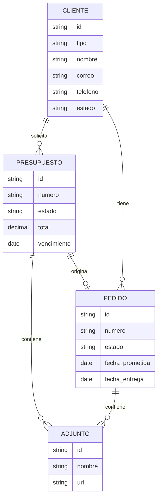

# Requerimientos del sistema administrativo de DA Sublimación

**Documento:** REQ-ADM-001  
**Versión:** 0.1  
**Estado:** Borrador inicial  
**Fecha de inicio:** 2026-09-24  
**Producto:** Sistema administrativo interno para DA Sublimación

## 1. Idea principal

DA Sublimación necesita un sistema interno que permita ordenar y controlar la operación comercial y productiva que comienza en la landing page.

El flujo principal del negocio será:

> **Cliente → Presupuesto → Pedido → Entrega**

Esta primera versión se enfocará en tres módulos:

1. **Clientes:** información centralizada de personas y empresas.
2. **Presupuestos:** creación, seguimiento y aprobación de cotizaciones.
3. **Pedidos:** control del trabajo aprobado hasta su entrega.

La landing page seguirá siendo el canal público de presentación y captación. El sistema administrativo será un espacio privado para gestionar la operación.

## 2. Objetivos

- Evitar información dispersa en chats, libretas o archivos individuales.
- Consultar rápidamente el historial de cada cliente.
- Convertir presupuestos aprobados en pedidos sin duplicar información.
- Conocer el estado actual de cada trabajo.
- Controlar cantidades, fechas, valores y observaciones.
- Preparar una base sólida para agregar inventario, producción, pagos y reportes en futuras etapas.

## 3. Alcance de la primera versión

### Incluido

- Registro, edición, consulta y búsqueda de clientes.
- Registro de contactos asociados a empresas.
- Creación de presupuestos con uno o varios conceptos.
- Estados y seguimiento de presupuestos.
- Conversión de un presupuesto aprobado en pedido.
- Registro y seguimiento de pedidos.
- Asociación entre clientes, presupuestos y pedidos.
- Historial básico de cambios relevantes.
- Panel inicial con indicadores de operación.

### Fuera de alcance inicial

- Contabilidad formal y facturación electrónica.
- Control de inventario y materias primas.
- Nómina y gestión de empleados.
- Planeación detallada de máquinas o turnos.
- Pasarela de pagos en línea.
- Automatizaciones avanzadas de correo o WhatsApp.
- Aplicación móvil nativa.

## 4. Usuarios y permisos iniciales

| Rol | Responsabilidad | Acceso inicial |
|---|---|---|
| Administrador | Configura el sistema y gestiona toda la información | Completo |
| Comercial | Registra clientes y prepara presupuestos | Clientes, presupuestos y consulta de pedidos |
| Producción | Consulta y actualiza el avance de pedidos | Pedidos asignados y datos operativos necesarios |
| Consulta | Revisa información sin modificarla | Lectura de clientes, presupuestos y pedidos |

Los permisos deben diseñarse desde el principio, aunque inicialmente se implemente solo el rol Administrador.

## 5. Módulo de Clientes

### 5.1 Propósito

Mantener una fuente única de información de las personas y empresas que solicitan servicios de confección, sublimación o costura.

### 5.2 Requerimientos funcionales

- **CLI-001:** El sistema debe permitir crear un cliente como persona natural o empresa.
- **CLI-002:** El sistema debe permitir registrar nombre, empresa, identificación, correo, teléfono, WhatsApp, dirección y ciudad.
- **CLI-003:** El sistema debe permitir registrar uno o varios contactos para una empresa.
- **CLI-004:** El sistema debe permitir clasificar al cliente: prospecto, activo, recurrente o inactivo.
- **CLI-005:** El sistema debe permitir buscar por nombre, empresa, teléfono, correo o identificación.
- **CLI-006:** El sistema debe mostrar el historial de presupuestos y pedidos relacionados.
- **CLI-007:** El sistema debe permitir agregar notas internas y etiquetas.
- **CLI-008:** El sistema debe impedir duplicados evidentes por correo, teléfono o identificación, mostrando una advertencia antes de guardar.
- **CLI-009:** El sistema debe permitir actualizar datos sin perder el historial de actividad.
- **CLI-010:** El sistema debe permitir desactivar un cliente sin eliminar sus presupuestos ni pedidos históricos.

### 5.3 Datos mínimos

- Tipo de cliente.
- Nombre o razón social.
- Nombre del contacto principal.
- Correo electrónico.
- Teléfono y WhatsApp.
- Dirección y ciudad.
- Identificación tributaria, si aplica.
- Estado.
- Fecha de creación.
- Última actividad.
- Notas y etiquetas.

### 5.4 Criterios de aceptación

- Un usuario puede crear un cliente y encontrarlo inmediatamente mediante búsqueda.
- Un cliente desactivado conserva sus relaciones históricas.
- Desde la ficha del cliente se pueden consultar sus presupuestos y pedidos.
- Los campos obligatorios se validan antes de guardar.

## 6. Módulo de Presupuestos

### 6.1 Propósito

Crear cotizaciones claras, trazables y asociadas a un cliente, con control de su estado comercial.

### 6.2 Requerimientos funcionales

- **PRE-001:** El sistema debe permitir crear un presupuesto desde un cliente existente.
- **PRE-002:** El sistema debe permitir crear un cliente nuevo durante la elaboración del presupuesto.
- **PRE-003:** El presupuesto debe tener un número único y consecutivo.
- **PRE-004:** El sistema debe permitir agregar uno o varios conceptos al presupuesto.
- **PRE-005:** Cada concepto debe permitir registrar servicio, descripción, cantidad, precio unitario, descuento e impuesto si aplica.
- **PRE-006:** El sistema debe calcular subtotal, descuentos, impuestos y total automáticamente.
- **PRE-007:** El sistema debe permitir registrar fecha de vencimiento, tiempo estimado de entrega y condiciones comerciales.
- **PRE-008:** El sistema debe permitir adjuntar diseños, logos, referencias o archivos técnicos.
- **PRE-009:** El presupuesto debe manejar los estados: borrador, enviado, en revisión, aprobado, rechazado, vencido y cancelado.
- **PRE-010:** El sistema debe registrar cuándo cambió el estado y quién realizó el cambio.
- **PRE-011:** El sistema debe permitir duplicar un presupuesto para reutilizar una cotización similar.
- **PRE-012:** Un presupuesto aprobado debe poder convertirse en pedido sin volver a digitar sus datos principales.
- **PRE-013:** El sistema debe conservar el valor y contenido aprobado aunque luego se creen nuevas versiones.
- **PRE-014:** El sistema debe permitir imprimir o exportar el presupuesto en PDF en una etapa posterior o mediante una plantilla inicial.

### 6.3 Datos mínimos

- Número del presupuesto.
- Cliente y contacto.
- Fecha de creación y vencimiento.
- Servicio solicitado.
- Conceptos cotizados.
- Cantidades y valores.
- Descripción técnica.
- Tiempo estimado.
- Forma y condiciones de pago.
- Estado.
- Adjuntos.
- Responsable comercial.
- Historial de cambios.

### 6.4 Reglas de negocio

- Un presupuesto no puede aprobarse sin cliente, conceptos y total mayor que cero.
- Un presupuesto vencido no puede convertirse directamente en pedido sin renovarse o confirmarse.
- La aprobación debe guardar la fecha y el usuario responsable.
- Si cambian cantidades, servicios o precios después de enviado, debe generarse una nueva versión o registrarse el cambio.

### 6.5 Criterios de aceptación

- El total se recalcula al cambiar cantidad, precio o descuento.
- El presupuesto puede pasar de borrador a enviado y luego a aprobado o rechazado.
- Un presupuesto aprobado crea un pedido relacionado con sus conceptos.
- El usuario puede identificar fácilmente presupuestos pendientes de respuesta.

## 7. Módulo de Pedidos

### 7.1 Propósito

Controlar la ejecución de los trabajos aprobados desde la confirmación hasta la entrega.

### 7.2 Requerimientos funcionales

- **PED-001:** El sistema debe permitir crear un pedido desde un presupuesto aprobado.
- **PED-002:** El pedido debe tener un número único y consecutivo.
- **PED-003:** El pedido debe conservar el cliente, conceptos, cantidades, valores y archivos del presupuesto de origen.
- **PED-004:** El sistema debe permitir crear pedidos manuales con autorización del usuario.
- **PED-005:** El pedido debe manejar los estados: confirmado, pendiente de materiales, en diseño, en producción, en control de calidad, listo para entregar, entregado, pausado y cancelado.
- **PED-006:** El sistema debe permitir registrar fecha de confirmación, fecha prometida y fecha real de entrega.
- **PED-007:** El sistema debe permitir agregar responsables, notas internas y observaciones de producción.
- **PED-008:** El sistema debe permitir consultar cantidades por talla, referencia, color o variante cuando el trabajo lo requiera.
- **PED-009:** El sistema debe permitir adjuntar archivos técnicos y evidencias del avance.
- **PED-010:** El sistema debe registrar el historial de cambios de estado.
- **PED-011:** El sistema debe permitir filtrar pedidos por estado, cliente, responsable y fecha prometida.
- **PED-012:** El sistema debe alertar visualmente sobre pedidos próximos a vencer o atrasados.
- **PED-013:** El sistema debe registrar la forma de entrega: envío, retiro en taller u otra.
- **PED-014:** El sistema debe permitir registrar quién recibió el pedido y cuándo fue entregado.

### 7.3 Datos mínimos

- Número del pedido.
- Presupuesto de origen.
- Cliente y contacto.
- Servicio y descripción.
- Cantidad total y variantes.
- Estado actual.
- Responsable.
- Fecha prometida.
- Fecha de entrega real.
- Forma de entrega.
- Archivos y observaciones.
- Historial de estados.

### 7.4 Reglas de negocio

- Un pedido debe estar relacionado con un cliente.
- Un pedido creado desde un presupuesto debe conservar la referencia al presupuesto aprobado.
- Solo usuarios autorizados pueden cancelar un pedido.
- Un pedido entregado no debe borrarse; únicamente puede corregirse mediante una acción registrada.
- Los atrasos se determinan comparando la fecha prometida con la fecha actual y el estado del pedido.

### 7.5 Criterios de aceptación

- Un presupuesto aprobado puede convertirse en pedido en una sola operación.
- El equipo puede saber qué pedidos están en producción, listos o atrasados.
- Un pedido entregado conserva su historial y evidencia.
- Los filtros permiten localizar un pedido sin revisar toda la lista.

## 8. Relación entre módulos

## 9. Panel inicial

El primer panel administrativo debería mostrar:

- Presupuestos pendientes de respuesta.
- Presupuestos aprobados recientes.
- Pedidos en producción.
- Pedidos próximos a la fecha prometida.
- Pedidos atrasados.
- Total de clientes activos.
- Accesos rápidos: nuevo cliente, nuevo presupuesto y nuevo pedido.

Los indicadores son informativos en esta etapa; no reemplazan un sistema contable.

## 10. Requerimientos no funcionales

- **RNF-001:** La interfaz administrativa debe ser responsive para escritorio, tablet y móvil.
- **RNF-002:** El sistema debe requerir autenticación antes de mostrar información interna.
- **RNF-003:** Los datos deben validarse tanto en la interfaz como en el servidor cuando exista backend.
- **RNF-004:** Las acciones críticas deben quedar registradas con usuario, fecha y hora.
- **RNF-005:** Los identificadores de clientes, presupuestos y pedidos deben ser únicos.
- **RNF-006:** No se deben eliminar físicamente registros con historial comercial; deben desactivarse o cancelarse.
- **RNF-007:** Los archivos adjuntos deben tener límites de tamaño, formatos permitidos y nombres seguros.
- **RNF-008:** La información sensible debe protegerse mediante permisos y conexión segura.
- **RNF-009:** El sistema debe permitir exportar listados básicos para respaldo y análisis.
- **RNF-010:** La experiencia debe mantener la identidad visual de DA, pero priorizar claridad y velocidad operativa.

## 11. Orden recomendado de implementación

### Fase 1: Base administrativa

- Definir autenticación y roles.
- Crear la estructura del panel privado.
- Crear base de datos y auditoría básica.
- Implementar el módulo de Clientes.

### Fase 2: Presupuestos

- Crear conceptos y cálculo de totales.
- Implementar estados y versiones.
- Asociar adjuntos.
- Crear la conversión a pedido.

### Fase 3: Pedidos

- Implementar estados operativos.
- Agregar fechas prometidas y alertas.
- Registrar responsables y entrega.
- Crear filtros y panel de seguimiento.

### Fase 4: Consolidación

- Panel con indicadores.
- Exportación de información.
- Plantilla PDF de presupuesto.
- Integración con WhatsApp y correo.
- Preparación para inventario, pagos y producción avanzada.

## 12. Decisiones pendientes

- Tecnología del backend y base de datos.
- Moneda, impuestos y formato de numeración.
- País y reglas fiscales aplicables.
- Quiénes serán los usuarios iniciales.
- Límites y formatos de archivos adjuntos.
- Plantilla oficial del presupuesto.
- Método de aprobación: manual, firma, correo o WhatsApp.
- Política de respaldo y retención de información.

## 13. Historial de requerimientos

| Versión | Fecha | Cambio | Estado |
|---|---|---|---|
| 0.1 | 2026-09-24 | Se crea el documento base y se definen los módulos Clientes, Presupuestos y Pedidos. | Inicial |
| 0.2 | 2026-09-25 | Se inicia el frontend del módulo Clientes en `admin/`: directorio, búsqueda, filtro por estado, alta, edición, ficha lateral, exportación CSV y persistencia local de prototipo. | Frontend inicial |
| 0.3 | 2026-09-25 | Se inicia el frontend de Presupuestos en `admin/presupuestos.html`: listado, estados, búsqueda, filtros, conceptos, cálculo de totales, adjunto, exportación CSV y persistencia local. | Frontend inicial |
| 0.4 | 2026-09-25 | Se inicia el frontend de Pedidos en `admin/pedidos.html`: seguimiento de estados, conversión desde presupuesto aprobado, responsables, fechas prometidas, alertas, entrega, historial visual y exportación CSV. | Frontend inicial |

### Regla para mantener el historial

Cada cambio importante debe agregarse como una nueva fila en esta tabla, sin borrar decisiones anteriores. Cuando un requisito se modifique, debe conservarse el requisito original y registrarse la razón del cambio en una nueva versión.

## 14. Estado del frontend inicial

El módulo Clientes cuenta con un prototipo navegable en `admin/`. En esta etapa los datos demo y los nuevos registros se guardan en `localStorage`; todavía no existe autenticación, API ni base de datos compartida.

Se cubren visualmente los requerimientos `CLI-001`, `CLI-002`, `CLI-004`, `CLI-005`, `CLI-006`, `CLI-007`, `CLI-008` y `CLI-009`. La validación real de permisos, duplicados entre usuarios, auditoría y desactivación persistente queda pendiente para el backend.

## 15. Estado del módulo Presupuestos

El módulo Presupuestos cuenta con un prototipo navegable en `admin/presupuestos.html`. Permite crear cotizaciones asociadas a clientes demo, agregar conceptos, calcular subtotal, descuento, impuesto y total, seleccionar estado, adjuntar una referencia y guardar datos localmente.

Se cubren visualmente los requerimientos `PRE-001`, `PRE-002`, `PRE-003`, `PRE-004`, `PRE-005`, `PRE-006`, `PRE-007`, `PRE-008`, `PRE-009` y `PRE-014`. La aprobación trazable, versionado, PDF real y conversión a pedido quedan pendientes de backend y del siguiente módulo.

## 16. Estado del módulo Pedidos

El módulo Pedidos cuenta con un prototipo navegable en `admin/pedidos.html`. Permite crear pedidos manuales o partir de presupuestos aprobados, asignar estado y responsable, definir fecha prometida, forma de entrega, variantes, observaciones y archivos de evidencia.

Se cubren visualmente los requerimientos `PED-001`, `PED-002`, `PED-003`, `PED-004`, `PED-005`, `PED-006`, `PED-007`, `PED-008`, `PED-009`, `PED-011`, `PED-012` y `PED-013`. La auditoría real de estados, permisos de cancelación, entrega firmada y persistencia multiusuario quedan pendientes del backend.

## 17. Próximo paso recomendado

Conectar los tres prototipos a un backend y una base de datos compartida, comenzando por:

1. Autenticación y roles.
2. Entidades Cliente, Presupuesto y Pedido.
3. API para crear, consultar y actualizar cada entidad.
4. Auditoría de estados y acciones críticas.
5. Reemplazo progresivo de `localStorage` por datos persistidos.

Esto convierte el prototipo frontend en una base operativa real sin perder el flujo central del negocio.
